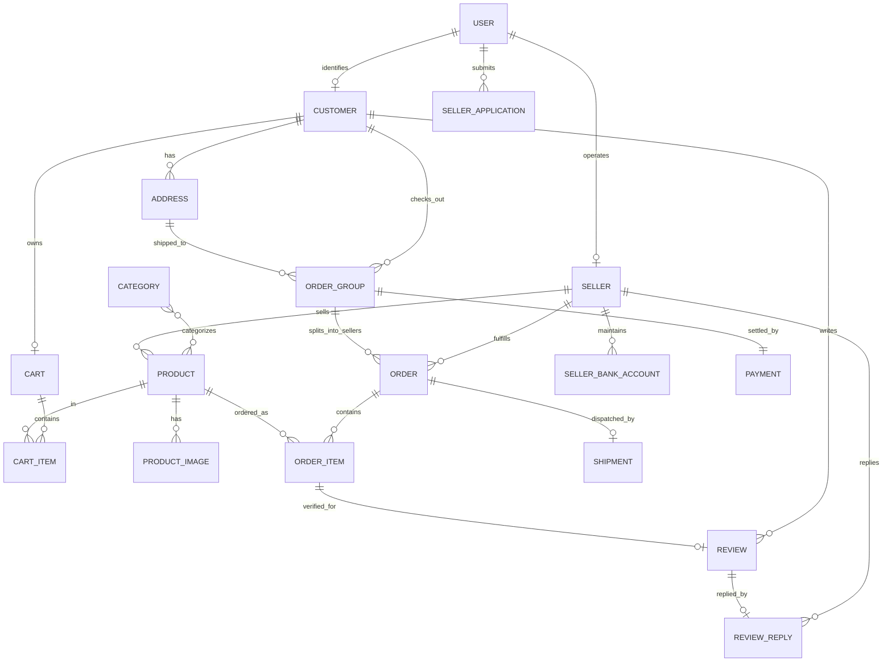

# รายงานการวิเคราะห์ Entity, Model (DTO/VO) และ Service Layer
### สถาปัตยกรรม E-Commerce Marketplace (รองรับ Multi-Seller: 1 OrderGroup สั่งได้หลายร้านค้าพร้อมกัน)
อ้างอิงจาก 4 Use Cases: (1) สั่งซื้อและชำระเงิน (3) Seller สมัครร้านค้า (4) Seller ลงสินค้า (5) ลูกค้ารีวิวสินค้า

---

## สารบัญ
1. [สรุปสาระสำคัญของ Use Cases และโจทย์ Multi-Seller](#1-สรุปสาระสำคัญของ-use-cases-และโจทย์-multi-seller)
2. [สถาปัตยกรรม Multi-Seller Checkout: ความแตกต่างระหว่าง OrderGroup และ Order (Sub-Order)](#2-สถาปัตยกรรม-multi-seller-checkout-ความแตกต่างระหว่าง-ordergroup-และ-order-sub-order)
3. [ส่วนที่ 1: Entity & Domain Model (Database Persistence Layer)](#ส่วนที่-1-entity--domain-model-database-persistence-layer)
   - 1.1 [User & Identity Domain](#11-user--identity-domain)
   - 1.2 [Seller & Shop Domain (UC3)](#12-seller--shop-domain-uc3)
   - 1.3 [Product & Catalog Domain (UC1, UC4)](#13-product--catalog-domain-uc1-uc4)
   - 1.4 [Cart, OrderGroup & Sub-Order Domain (UC1 - Multi-Seller Core)](#14-cart-ordergroup--sub-order-domain-uc1---multi-seller-core)
   - 1.5 [Review & Rating Domain (UC5)](#15-review--rating-domain-uc5)
   - 1.6 [Notification Domain](#16-notification-domain)
   - 1.7 [Mermaid Entity Relationship Diagram (ERD ฉบับสมบูรณ์)](#17-mermaid-entity-relationship-diagram-erd-ฉบับสมบูรณ์)
4. [ส่วนที่ 2: Data Models (DTOs & Value Objects)](#ส่วนที่-2-data-models-dtos--value-objects)
   - 2.1 [Request DTOs (Input Models)](#21-request-dtos-input-models)
   - 2.2 [Response DTOs / View Models (Output Models)](#22-response-dtos--view-models-output-models)
   - 2.3 [Value Objects & State Enums](#23-value-objects--state-enums)
5. [ส่วนที่ 3: Service Layer (Business Logic & Multi-Seller Orchestration)](#ส่วนที่-3-service-layer-business-logic--multi-seller-orchestration)
   - 3.1 [ตารางสรุป Service ทั้งหมด](#31-ตารางสรุป-service-ทั้งหมด)
   - 3.2 [รายละเอียด Service และ Method Signatures](#32-รายละเอียด-service-และ-method-signatures)
   - 3.3 [Multi-Seller Checkout & Lifecycle Workflow (เจาะลึก Step 23-45A)](#33-multi-seller-checkout--lifecycle-workflow-เจาะลึก-step-23-45a)
   - 3.4 [Background / Scheduled Tasks (Jobs: Auto-Confirm 7 วัน & Auto-Review 2 วัน)](#34-background--scheduled-tasks-jobs-auto-confirm-7-วัน--auto-review-2-วัน)
6. [ส่วนที่ 4: การวิเคราะห์และออกแบบ Unit Test ด้วย Mockito (สำหรับ UC3 ข้อ 9, 10, 11)](#ส่วนที่-4-การวิเคราะห์และออกแบบ-unit-test-ด้วย-mockito-สำหรับ-uc3-ข้อ-9-10-11)
   - 4.1 [วิเคราะห์ Business Logic ในขั้นตอน 9, 10, 11](#41-วิเคราะห์-business-logic-ในขั้นตอน-9-10-11)
   - 4.2 [ตัวอย่างการเขียน Unit Test ด้วย JUnit 5 + Mockito](#42-ตัวอย่างการเขียน-unit-test-ด้วย-junit-5--mockito)
7. [ส่วนที่ 5: การ Mapping ความสัมพันธ์ Service ↔ Entity ↔ Use Case](#ส่วนที่-5-การ-mapping-ความสัมพันธ์-service--entity--use-case)
8. [ส่วนที่ 6: ข้อพิจารณาทางสถาปัตยกรรม (Design Notes & Best Practices)](#ส่วนที่-6-ข้อพิจารณาทางสถาปัตยกรรม-design-notes--best-practices)

---

## 1. สรุปสาระสำคัญของ Use Cases และโจทย์ Multi-Seller

ในการทำงานของระบบ Marketplace สินค้าในตะกร้าของลูกค้าสามารถมาจาก **ผู้ขายหลายราย (Multiple Sellers)** พร้อมกัน ดังนั้นเมื่อลูกค้ากด "ชำระเงิน (Checkout)":
1. **การชำระเงิน (Payment):** ลูกค้าชำระเงิน **ยอดรวมทั้งหมดเพียงครั้งเดียว** ผ่าน Payment Gateway (ระดับ `OrderGroup`)
2. **การจัดการคำสั่งซื้อ (Order Management):** ระบบต้องแตกคำสั่งซื้อออกเป็น **Sub-Order (ตาราง `Order`) แยกตามร้านค้าแต่ละร้าน** เนื่องจาก:
   - แต่ละร้านมีคลังสินค้าและสถานที่จัดส่งต่างกัน (คิดค่าส่งแยกกันได้)
   - แต่ละร้านตรวจสอบและกดยอมรับ/ปฏิเสธคำสั่งซื้อแยกเป็นอิสระต่อกัน (UC1-37A: ร้าน A ปฏิเสธ ไม่กระทบร้าน B แต่ต้องคืนเงินบางส่วน Partial Refund)
   - แต่ละร้านจัดส่งพัสดุและมีเลข Tracking Number ของตัวเอง (UC1-41)
   - ระยะเวลาการจัดส่งถึงมือลูกค้าต่างกัน (UC1-45A: Auto-confirm 7 วัน นับแยกตามร้านที่ส่งถึง)
3. **การรีวิวสินค้า (Review):** รีวิวผูกกับสินค้าที่ซื้อจริงระดับ `OrderItem` (UC5-6A: Auto-review 5 ดาว 2 วัน นับแยกหลังร้านนั้นๆ COMPLETED)
4. **การสมัครร้านค้า (UC3):** ข้อ 9, 10, 11 ออกแบบด้วย TDD/Unit Testing โดยใช้ **Mockito**
5. **การลงสินค้า (UC4):** ตรวจสอบราคา > 0, สต็อก $\ge$ 0 และอัปโหลดรูปภาพได้หลายรูป

---

## 2. สถาปัตยกรรม Multi-Seller Checkout: ความแตกต่างระหว่าง OrderGroup และ Order (Sub-Order)

```
                       [ ลูกค้ากดชำระเงิน 1 ครั้ง ]
                                    │
                                    ▼
                          ┌───────────────────┐
                          │    OrderGroup     │ <--- ยอดรวมทั้งบิล (Grand Total)
                          │ (Master Checkout) │ <--- ชำระเงิน 1 ครั้ง (1 Payment)
                          └─────────┬─────────┘
                                    │
           ┌────────────────────────┼────────────────────────┐
           ▼                                                 ▼
┌──────────────────────┐                          ┌──────────────────────┐
│  Order (ร้านค้า A)   │                          │  Order (ร้านค้า B)   │
│ (Sub-Order ร้าน A)   │                          │ (Sub-Order ร้าน B)   │
├──────────────────────┤                          ├──────────────────────┤
│ • ค่าส่งของร้าน A    │                          │ • ค่าส่งของร้าน B    │
│ • ร้าน A กดยืนยัน    │                          │ • ร้าน B ปฏิเสธ (37A)│
│ • ร้าน A ส่งพัสดุ A  │                          │ • คืนเงินเฉพาะร้าน B │
│ • Tracking No. ของ A │                          │ • คืน Stock ของร้าน B│
└──────────┬───────────┘                          └──────────────────────┘
           │
     ┌─────┴─────────────────┐
     ▼                       ▼
┌──────────────┐      ┌──────────────┐
│  OrderItem   │      │   Shipment   │
│ (สินค้าชิ้นที่ 1)│   │(Kerry: TH123)│
└──────────────┘      └──────────────┘
```

- **`OrderGroup` (Parent / Master Order):** ตัวแทนของการทำรายการสั่งซื้อ 1 ตะกร้า ผูกกับ `CustomerId`, `Address` และทำธุรกรรม `Payment` เพียง 1 รายการ
- **`Order` (Child / Sub-Order ประจำร้าน):** คำสั่งซื้อย่อยที่แยกตาม `SellerId` จัดการสถานะคำสั่งซื้อ, การแพ็กของ, บริษัทขนส่ง, และเลข Tracking Number ของแต่ละร้านแยกเป็นอิสระ

---

## ส่วนที่ 1: Entity & Domain Model (Database Persistence Layer)

### 1.1 User & Identity Domain

#### `User` (ตารางหลักบัญชีผู้ใช้งาน)
| Attribute | Data Type | Constraint | คำอธิบาย |
|---|---|---|---|
| `userId` | `UUID` / `Long` | PK, Not Null | รหัสผู้ใช้งาน |
| `username` | `VARCHAR(50)` | Unique, Not Null | ชื่อผู้ใช้ |
| `email` | `VARCHAR(100)` | Unique, Not Null | อีเมล |
| `passwordHash` | `VARCHAR(255)` | Not Null | รหัสผ่านเข้ารหัส BCrypt |
| `role` | `ENUM` | Not Null | `CUSTOMER`, `SELLER`, `ADMIN` |
| `status` | `ENUM` | Not Null | `ACTIVE`, `SUSPENDED`, `INACTIVE` |
| `createdAt` | `TIMESTAMP` | Not Null | วันที่สร้างบัญชี |
| `updatedAt` | `TIMESTAMP` | Nullable | วันที่แก้ไขล่าสุด |

#### `Customer` (ข้อมูลโปรไฟล์ลูกค้า)
| Attribute | Data Type | Constraint | คำอธิบาย |
|---|---|---|---|
| `customerId` | `UUID` / `Long` | PK, Not Null | รหัสลูกค้า |
| `userId` | `UUID` / `Long` | FK (User), Unique, Not Null | เชื่อมโยงบัญชีผู้ใช้หลัก |
| `fullName` | `VARCHAR(100)` | Nullable | ชื่อ-นามสกุลลูกค้า |
| `phoneNumber` | `VARCHAR(20)` | Nullable | เบอร์โทรศัพท์ |

#### `Address` (ที่อยู่สำหรับจัดส่ง - UC1 Checkout)
| Attribute | Data Type | Constraint | คำอธิบาย |
|---|---|---|---|
| `addressId` | `UUID` / `Long` | PK, Not Null | รหัสที่อยู่ |
| `customerId` | `UUID` / `Long` | FK (Customer), Not Null | ลูกค้าเจ้าของที่อยู่ |
| `receiverName` | `VARCHAR(100)` | Not Null | ชื่อผู้รับ |
| `phoneNumber` | `VARCHAR(20)` | Not Null | เบอร์โทรศัพท์ผู้รับ |
| `addressLine` | `VARCHAR(255)` | Not Null | บ้านเลขที่ ซอย ถนน |
| `district` | `VARCHAR(100)` | Not Null | เขต / อำเภอ |
| `province` | `VARCHAR(100)` | Not Null | จังหวัด |
| `postalCode` | `VARCHAR(10)` | Not Null | รหัสไปรษณีย์ |
| `isDefault` | `BOOLEAN` | Default False | ที่อยู่เริ่มต้นหรือไม่ |

---

### 1.2 Seller & Shop Domain (UC3)

#### `Seller` (ข้อมูลผู้ขายและร้านค้า)
| Attribute | Data Type | Constraint | คำอธิบาย |
|---|---|---|---|
| `sellerId` | `UUID` / `Long` | PK, Not Null | รหัสผู้ขาย |
| `userId` | `UUID` / `Long` | FK (User), Unique, Not Null | เชื่อมโยงบัญชีผู้ใช้ |
| `shopName` | `VARCHAR(100)` | Unique, Not Null | ชื่อร้านค้า |
| `shopDescription` | `TEXT` | Nullable | รายละเอียดร้าน |
| `shopPhone` | `VARCHAR(20)` | Not Null | เบอร์โทรศัพท์ร้าน |
| `shopEmail` | `VARCHAR(100)` | Not Null | อีเมลติดต่อร้าน |
| `shopAddress` | `VARCHAR(255)` | Not Null | ที่อยู่ร้านค้า |
| `status` | `ENUM` | Not Null | `PENDING`, `ACTIVE`, `REJECTED`, `SUSPENDED` |
| `rating` | `DECIMAL(3,2)` | Default 0.00 | คะแนนรีวิวรวมของร้าน |
| `createdAt` | `TIMESTAMP` | Not Null | วันเวลาเปิดร้าน |

#### `SellerApplication` (คำขอเปิดร้านค้า - เน้นใน UC3 ข้อ 9, 10, 11)
| Attribute | Data Type | Constraint | คำอธิบาย |
|---|---|---|---|
| `applicationId` | `UUID` / `Long` | PK, Not Null | รหัสใบสมัคร |
| `userId` | `UUID` / `Long` | FK (User), Not Null | ผู้ยื่นคำขอ |
| `shopName` | `VARCHAR(100)` | Not Null | ชื่อร้านที่ขอตั้ง |
| `shopDescription` | `TEXT` | Not Null | รายละเอียดร้านค้า |
| `shopPhone` | `VARCHAR(20)` | Not Null | เบอร์โทรศัพท์ร้าน |
| `shopEmail` | `VARCHAR(100)` | Not Null | อีเมลติดต่อร้าน |
| `shopAddress` | `VARCHAR(255)` | Not Null | ที่อยู่ร้าน |
| `sellerFirstName` | `VARCHAR(100)` | Not Null | ชื่อจริงผู้สมัคร |
| `sellerLastName` | `VARCHAR(100)` | Not Null | นามสกุลจริงผู้สมัคร |
| `idCardNumber` | `VARCHAR(13)` | Not Null | เลขประจำตัวประชาชน 13 หลัก |
| `idCardImageUrl` | `VARCHAR(255)` | Not Null | รูปถ่ายบัตรประชาชน |
| `bankAccountName` | `VARCHAR(100)` | Not Null | ชื่อบัญชีธนาคาร |
| `bankName` | `VARCHAR(100)` | Not Null | ชื่อธนาคาร |
| `bankAccountNumber`| `VARCHAR(30)` | Not Null | เลขที่บัญชี |
| `bankBookImageUrl` | `VARCHAR(255)` | Not Null | รูปถ่ายหน้าสมุดบัญชี |
| `status` | `ENUM` | Not Null | `PENDING`, `APPROVED`, `REJECTED`, `NEED_MORE_DOC` (Step 11 กำหนดเป็น `PENDING`) |
| `adminNote` | `TEXT` | Nullable | เหตุผลที่ปฏิเสธหรือขอเอกสารเพิ่ม |
| `reviewedBy` | `UUID` / `Long` | FK (User), Nullable | แอดมินผู้ตรวจสอบ |
| `reviewedAt` | `TIMESTAMP` | Nullable | วันที่ตรวจสอบ |
| `createdAt` | `TIMESTAMP` | Not Null | วันที่ยื่นใบสมัคร (Step 10) |

#### `SellerBankAccount` (บัญชีรับเงินของร้านค้า)
| Attribute | Data Type | Constraint | คำอธิบาย |
|---|---|---|---|
| `bankAccountId` | `UUID` / `Long` | PK, Not Null | รหัสบัญชี |
| `sellerId` | `UUID` / `Long` | FK (Seller), Not Null | ผู้ขายเจ้าของบัญชี |
| `bankName` | `VARCHAR(100)` | Not Null | ชื่อธนาคาร |
| `accountNumber` | `VARCHAR(30)` | Not Null | เลขที่บัญชี |
| `accountName` | `VARCHAR(100)` | Not Null | ชื่อบัญชี |
| `proofImageUrl` | `VARCHAR(255)` | Not Null | รูปภาพหน้าสมุดบัญชี |

---

### 1.3 Product & Catalog Domain (UC1, UC4)

#### `Category` (หมวดหมู่สินค้า)
| Attribute | Data Type | Constraint | คำอธิบาย |
|---|---|---|---|
| `categoryId` | `UUID` / `Long` | PK, Not Null | รหัสหมวดหมู่ |
| `categoryName` | `VARCHAR(100)` | Not Null | ชื่อหมวดหมู่ |
| `description` | `VARCHAR(255)` | Nullable | คำอธิบายหมวดหมู่ |

#### `Product` (สินค้า - สร้างใน UC4, สั่งซื้อใน UC1, รีวิวใน UC5)
| Attribute | Data Type | Constraint | คำอธิบาย |
|---|---|---|---|
| `productId` | `UUID` / `Long` | PK, Not Null | รหัสสินค้า |
| `sellerId` | `UUID` / `Long` | FK (Seller), Not Null | ร้านค้าผู้ขาย |
| `categories` | `Set<Category>` | Many-to-Many | ผูกกับหมวดหมู่สินค้าผ่านตาราง `product_categories` |
| `name` | `VARCHAR(200)` | Not Null | ชื่อสินค้า |
| `description` | `TEXT` | Nullable | รายละเอียดสินค้า |
| `price` | `DECIMAL(12,2)` | Not Null, Check > 0 | ราคาสินค้า (> 0 ตาม UC4-12A) |
| `stock` | `INTEGER` | Not Null, Check >= 0 | จำนวนสต็อกคงเหลือ ($\ge$ 0 ตาม UC4-13A) |
| `status` | `ENUM` | Not Null | `ACTIVE` (พร้อมขาย), `OUT_OF_STOCK`, `INACTIVE` |
| `averageRating` | `DECIMAL(3,2)` | Default 0.00 | คะแนนเฉลี่ย (1.00 - 5.00) |
| `reviewCount` | `INTEGER` | Default 0 | จำนวนรีวิวทั้งหมด |
| `shippingInfo` | `VARCHAR(255)` | Nullable | ข้อมูลน้ำหนัก/มิติสำหรับคิดค่าส่ง |
| `createdAt` | `TIMESTAMP` | Not Null | วันที่สร้างสินค้า |
| `updatedAt` | `TIMESTAMP` | Nullable | วันที่แก้ไขล่าสุด |

#### `ProductCategory` (ตารางเชื่อม Many-to-Many: `product_categories`)
| Attribute | Data Type | Constraint | คำอธิบาย |
|---|---|---|---|
| `productId` | `UUID` / `Long` | Composite PK, FK (Product), Not Null | รหัสสินค้า |
| `categoryId` | `UUID` / `Long` | Composite PK, FK (Category), Not Null | รหัสหมวดหมู่สินค้า |


#### `ProductImage` (รูปภาพสินค้า - รองรับหลายรูปตาม UC4)
| Attribute | Data Type | Constraint | คำอธิบาย |
|---|---|---|---|
| `imageId` | `UUID` / `Long` | PK, Not Null | รหัสรูปภาพ |
| `productId` | `UUID` / `Long` | FK (Product), Not Null | สินค้าที่ผูก |
| `imageUrl` | `VARCHAR(255)` | Not Null | URL/Path รูปภาพ |
| `isPrimary` | `BOOLEAN` | Default False | รูปหลัก (Cover Image) |
| `displayOrder` | `INTEGER` | Default 0 | ลำดับการแสดงผล |

---

### 1.4 Cart, OrderGroup & Sub-Order Domain (UC1 - Multi-Seller Core)

#### `Cart` & `CartItem` (ตะกร้าสินค้า)
| Table | Attribute | Data Type | Constraint | คำอธิบาย |
|---|---|---|---|---|
| `Cart` | `cartId` | `UUID` / `Long` | PK, Not Null | รหัสตะกร้า |
| | `customerId` | `UUID` / `Long` | FK (Customer), Unique | ลูกค้าเจ้าของตะกร้า (1:1) |
| `CartItem` | `cartItemId` | `UUID` / `Long` | PK, Not Null | รหัสรายการในตะกร้า |
| | `cartId` | `UUID` / `Long` | FK (Cart), Not Null | ตะกร้าที่สังกัด |
| | `productId` | `UUID` / `Long` | FK (Product), Not Null | สินค้าที่เลือก (แต่ละชิ้นมี `sellerId` ต่างกันได้) |
| | `quantity` | `INTEGER` | Not Null, Check > 0 | จำนวนที่ต้องการซื้อ |
| | `isSelected` | `BOOLEAN` | Default True | เลือกว่าจะสั่งซื้อรายการนี้หรือไม่ |

#### `OrderGroup` (Master Order - ตัวแทนการชำระเงิน 1 ครั้งของลูกค้า)
> **หัวใจสำคัญของ Multi-Seller:** รวมทุก Sub-Order จากร้านต่างๆ ในการกดสั่งซื้อครั้งเดียว ผูกกับ Payment Gateway โดยตรง
| Attribute | Data Type | Constraint | คำอธิบาย |
|---|---|---|---|
| `orderGroupId` | `UUID` / `Long` | PK, Not Null | รหัสกลุ่มคำสั่งซื้อ (Master Group ID) |
| `groupNumber` | `VARCHAR(36)` | Unique, Not Null | เลขอ้างอิงบิล เช่น `GRP-20260903-XXXX` |
| `customerId` | `UUID` / `Long` | FK (Customer), Not Null | ลูกค้าผู้สั่งซื้อ |
| `shippingAddressId`| `UUID` / `Long` | FK (Address), Not Null | ที่อยู่จัดส่งหลักของบิล |
| `totalProductsAmount`| `DECIMAL(12,2)` | Not Null | ยอดรวมราคาสินค้าทุกร้าน |
| `totalShippingFee` | `DECIMAL(12,2)` | Not Null | ยอดรวมค่าส่งทุกร้าน |
| `totalDiscount` | `DECIMAL(12,2)` | Default 0.00 | ส่วนลดรวม |
| `grandTotal` | `DECIMAL(12,2)` | Not Null | ยอดเงินสุทธิที่ลูกค้าต้องจ่ายจริง |
| `paymentStatus` | `ENUM` | Not Null | `PENDING`, `PAID`, `PARTIALLY_REFUNDED`, `REFUNDED`, `FAILED` |
| `createdAt` | `TIMESTAMP` | Not Null | วันเวลาที่เริ่มทำรายการ Checkout |

#### `Order` (Sub-Order ประจำแต่ละร้านค้า - Seller Order)
> **1 OrderGroup แตกเป็น N Order ตามจำนวนร้านค้าที่ลูกค้าเลือกซื้อ**
| Attribute | Data Type | Constraint | คำอธิบาย |
|---|---|---|---|
| `orderId` | `UUID` / `Long` | PK, Not Null | รหัสคำสั่งซื้อย่อยของร้าน |
| `subOrderNumber` | `VARCHAR(36)` | Unique, Not Null | เลขอ้างอิง เช่น `ORD-SHOP01-20260903-XXXX` |
| `orderGroupId` | `UUID` / `Long` | FK (OrderGroup), Not Null | ผูกกับ OrderGroup แม่ (N:1) |
| `sellerId` | `UUID` / `Long` | FK (Seller), Not Null | ร้านค้าผู้รับผิดชอบคำสั่งซื้อนี้ |
| `subtotal` | `DECIMAL(12,2)` | Not Null | ยอดรวมสินค้าเฉพาะของร้านนี้ |
| `shippingFee` | `DECIMAL(12,2)` | Not Null | ค่าจัดส่งเฉพาะของร้านนี้ |
| `sellerDiscount` | `DECIMAL(12,2)` | Default 0.00 | ส่วนลดของร้าน |
| `totalAmount` | `DECIMAL(12,2)` | Not Null | ยอดรวมของร้านนี้ (`subtotal + shippingFee - discount`) |
| `orderStatus` | `ENUM` | Not Null | `WAITING_SELLER_CONFIRM`, `PREPARING`, `SHIPPED`, `COMPLETED`, `CANCELLED` |
| `rejectionReason` | `VARCHAR(255)` | Nullable | เหตุผลที่ร้านนี้ปฏิเสธ (UC1-37A เช่น สินค้าหมด, เสียหาย) |
| `shippedAt` | `TIMESTAMP` | Nullable | วันที่ร้านนี้ส่งพัสดุ (ใช้นับถอยหลัง Auto-confirm 7 วัน ใน UC1-45A) |
| `completedAt` | `TIMESTAMP` | Nullable | วันที่ลูกค้ารับของ (ใช้นับถอยหลัง Auto-review 2 วัน ใน UC5-6A) |
| `createdAt` | `TIMESTAMP` | Not Null | วันเวลาที่สร้าง Order ย่อย |

#### `OrderItem` (รายการสินค้าใน Sub-Order ของแต่ละร้าน)
| Attribute | Data Type | Constraint | คำอธิบาย |
|---|---|---|---|
| `orderItemId` | `UUID` / `Long` | PK, Not Null | รหัสรายการสินค้า |
| `orderId` | `UUID` / `Long` | FK (Order), Not Null | ผูกกับ Sub-Order ของร้านที่ขายสินค้านี้ |
| `productId` | `UUID` / `Long` | FK (Product), Not Null | สินค้าที่สั่งซื้อ |
| `productName` | `VARCHAR(200)` | Not Null | Snapshot ชื่อสินค้าขณะซื้อ |
| `unitPrice` | `DECIMAL(12,2)` | Not Null | Snapshot ราคาขณะซื้อ |
| `quantity` | `INTEGER` | Not Null, Check > 0 | จำนวนชิ้น |
| `totalPrice` | `DECIMAL(12,2)` | Not Null | ราคารวม (`unitPrice * quantity`) |
| `isReviewed` | `BOOLEAN` | Default False | สถานะว่าสินค้านี้ถูกรีวิวแล้วหรือยัง (UC5) |

#### `Payment` (ธุรกรรมการเงินระดับ OrderGroup)
> ลูกค้าจ่ายครั้งเดียวให้ `OrderGroup` เมื่อจ่ายสำเร็จ เงินจะถูกตัด และหากมีบางร้านปฏิเสธ จะทำการ Partial Refund คืนตามยอดของ Sub-Order นั้น
| Attribute | Data Type | Constraint | คำอธิบาย |
|---|---|---|---|
| `paymentId` | `UUID` / `Long` | PK, Not Null | รหัสธุรกรรมการชำระเงิน |
| `orderGroupId` | `UUID` / `Long` | FK (OrderGroup), Unique, Not Null | ผูกกับ OrderGroup (1:1) |
| `paymentMethod` | `ENUM` | Not Null | `CREDIT_CARD`, `PROMPTPAY`, `BANK_TRANSFER`, `WALLET` |
| `amount` | `DECIMAL(12,2)` | Not Null | ยอดเงินที่ชำระจริง (`grandTotal`) |
| `refundedAmount`| `DECIMAL(12,2)` | Default 0.00 | ยอดเงินที่คืนสะสม (Partial Refund กรณีบางร้านปฏิเสธ UC1-37A) |
| `status` | `ENUM` | Not Null | `PENDING`, `SUCCESS`, `FAILED`, `PARTIALLY_REFUNDED`, `REFUNDED` |
| `gatewayTransactionId`| `VARCHAR(100)` | Nullable | รหัสอ้างอิงจาก Payment Gateway |
| `paidAt` | `TIMESTAMP` | Nullable | วันเวลาที่ชำระเงินสำเร็จ |

#### `Shipment` (การจัดส่งพัสดุระดับ Sub-Order ของแต่ละร้านค้า)
> แต่ละร้านค้าจัดส่งแยกกล่อง และกรอกหมายเลข Tracking แยกกัน
| Attribute | Data Type | Constraint | คำอธิบาย |
|---|---|---|---|
| `shipmentId` | `UUID` / `Long` | PK, Not Null | รหัสการจัดส่ง |
| `orderId` | `UUID` / `Long` | FK (Order), Unique, Not Null | ผูกกับ Sub-Order ของร้าน (1:1) |
| `courierName` | `VARCHAR(100)` | Not Null (Step 41) | บริษัทขนส่ง (Kerry, Flash, ไปรษณีย์ไทย ฯลฯ) |
| `trackingNumber` | `VARCHAR(100)` | Not Null (Step 41) | หมายเลขพัสดุ Tracking (UC1-41A: ต้องกรอกก่อนเปลี่ยนสถานะ) |
| `shippingStatus` | `ENUM` | Not Null | `PENDING`, `SHIPPED`, `DELIVERED` |
| `shippedAt` | `TIMESTAMP` | Nullable | วันที่มอบของให้ขนส่ง |
| `deliveredAt` | `TIMESTAMP` | Nullable | วันที่พัสดุส่งถึงมือลูกค้า |

---

### 1.5 Review & Rating Domain (UC5)

#### `Review` (รีวิวและคะแนนสินค้า)
| Attribute | Data Type | Constraint | คำอธิบาย |
|---|---|---|---|
| `reviewId` | `UUID` / `Long` | PK, Not Null | รหัสรีวิว |
| `orderItemId` | `UUID` / `Long` | FK (OrderItem), Unique, Not Null | 1 OrderItem รีวิวได้ 1 ครั้ง (ป้องกันรีวิวซ้ำ UC5-16A) |
| `productId` | `UUID` / `Long` | FK (Product), Not Null | สินค้าที่ถูกรีวิว |
| `customerId` | `UUID` / `Long` | FK (Customer), Not Null | ลูกค้าผู้รีวิว (Verified Purchase) |
| `rating` | `INTEGER` | Not Null, Check 1..5 | คะแนน 1 ถึง 5 ดาว |
| `comment` | `TEXT` | Nullable | ข้อความรีวิว |
| `isAutoReview` | `BOOLEAN` | Default False | แฟล็กบอกว่าเป็น Auto 5-Star หรือไม่ (UC5-6A) |
| `createdAt` | `TIMESTAMP` | Not Null | วันเวลาที่สร้างรีวิว |
| `updatedAt` | `TIMESTAMP` | Nullable | วันเวลาที่ลูกค้าแก้ไขรีวิว (UC5-16A) |

#### `ReviewReply` (การตอบกลับรีวิวของผู้ขาย - UC5-23A)
| Attribute | Data Type | Constraint | คำอธิบาย |
|---|---|---|---|
| `replyId` | `UUID` / `Long` | PK, Not Null | รหัสการตอบกลับ |
| `reviewId` | `UUID` / `Long` | FK (Review), Unique, Not Null | รีวิวที่ตอบกลับ (1:1) |
| `sellerId` | `UUID` / `Long` | FK (Seller), Not Null | ผู้ขายที่ตอบ |
| `replyMessage` | `TEXT` | Not Null | ข้อความตอบกลับ |
| `repliedAt` | `TIMESTAMP` | Not Null | วันเวลาที่ตอบกลับ |

---

### 1.6 Notification Domain

#### `Notification` (ระบบแจ้งเตือน)
| Attribute | Data Type | Constraint | คำอธิบาย |
|---|---|---|---|
| `notificationId` | `UUID` / `Long` | PK, Not Null | รหัสแจ้งเตือน |
| `recipientUserId` | `UUID` / `Long` | FK (User), Not Null | ผู้รับแจ้งเตือน (ลูกค้า, ร้านค้า, แอดมิน) |
| `title` | `VARCHAR(150)` | Not Null | หัวข้อแจ้งเตือน |
| `message` | `TEXT` | Not Null | รายละเอียด |
| `type` | `ENUM` | Not Null | `PAYMENT_SUCCESS`, `NEW_ORDER_FOR_SELLER`, `ORDER_SHIPPED`, `NEW_REVIEW`, `SELLER_APPROVED` |
| `isRead` | `BOOLEAN` | Default False | อ่านแล้วหรือยัง |
| `createdAt` | `TIMESTAMP` | Not Null | วันเวลาแจ้งเตือน |

---

### 1.7 Mermaid Entity Relationship Diagram (ERD ฉบับสมบูรณ์)



---

## ส่วนที่ 2: Data Models (DTOs & Value Objects)

### 2.1 Request DTOs (Input Models)

```java
// ==================== Multi-Seller Checkout Request ====================
public class CheckoutRequest {
    @NotNull(message = "Shipping address is required")
    private Long shippingAddressId;

    // เลือกระบบขนส่งแยกตามแต่ละร้านค้า
    @NotEmpty(message = "Shipping options must be provided for all shops")
    private Map<Long, String> sellerShippingMethods; // Key: sellerId, Value: shippingMethod (e.g. "KERRY", "FLASH")

    @NotNull(message = "Payment method is required")
    private PaymentMethod paymentMethod;
}

// ==================== Seller Shipping Tracking (UC1 Step 41) ====================
public class DispatchOrderRequest {
    @NotBlank(message = "Courier name is required")
    private String courierName;

    @NotBlank(message = "Tracking number is required") // UC1-41A
    private String trackingNumber;
}

// ==================== Seller Application Request (UC3) ====================
public class SellerApplicationRequest {
    @NotBlank private String shopName;
    @NotBlank private String shopDescription;
    @NotBlank private String shopPhone;
    @NotBlank private String shopEmail;
    @NotBlank private String shopAddress;
    @NotBlank private String sellerFirstName;
    @NotBlank private String sellerLastName;
    @Pattern(regexp = "^[0-9]{13}$", message = "ID Card must be 13 digits")
    private String idCardNumber;
    @NotBlank private String idCardImageUrl;
    @NotBlank private String bankAccountName;
    @NotBlank private String bankName;
    @NotBlank private String bankAccountNumber;
    @NotBlank private String bankBookImageUrl;
}

// ==================== Product Creation Request (UC4) ====================
public class ProductCreateRequest {
    @NotBlank private String name;
    @NotEmpty(message = "At least one category is required") private Set<Long> categoryIds;
    private String description;
    @NotNull @DecimalMin(value = "0.01", message = "Price must be > 0") // UC4-12A
    private BigDecimal price;
    @NotNull @Min(value = 0, message = "Stock cannot be negative")      // UC4-13A
    private Integer stock;
    @NotEmpty(message = "At least one image is required")               // UC4-2
    private List<String> imageUrls;
    private String shippingInfo;
}

// ==================== Review Creation Request (UC5) ====================
public class CreateReviewRequest {
    @NotNull private Long orderItemId;
    @NotNull @Min(1) @Max(5) // UC5-13A
    private Integer rating;
    private String comment;
}
```

### 2.2 Response DTOs / View Models (Output Models)

```java
// ==================== Master OrderGroup Response ====================
public class OrderGroupSummaryResponse {
    private Long orderGroupId;
    private String groupNumber;
    private BigDecimal totalProductsAmount;
    private BigDecimal totalShippingFee;
    private BigDecimal grandTotal;
    private PaymentStatus paymentStatus;
    private LocalDateTime createdAt;
    private List<SubOrderSummaryResponse> subOrders; // รายการแยกตามร้าน
}

// ==================== Sub-Order Response (ระดับร้านค้า) ====================
public class SubOrderSummaryResponse {
    private Long orderId;
    private String subOrderNumber;
    private Long sellerId;
    private String shopName;
    private BigDecimal subtotal;
    private BigDecimal shippingFee;
    private BigDecimal totalAmount;
    private OrderStatus orderStatus;
    private String courierName;
    private String trackingNumber;
    private List<OrderItemResponse> items;
}

public class OrderItemResponse {
    private Long orderItemId;
    private Long productId;
    private String productName;
    private BigDecimal unitPrice;
    private Integer quantity;
    private BigDecimal totalPrice;
    private Boolean isReviewed;
}
```

### 2.3 Value Objects & State Enums

- **`OrderStatus` (สำหรับ Sub-Order แต่ละร้านค้า):**
  - `WAITING_SELLER_CONFIRM` (ชำระเงินแล้ว รอร้านค้ายืนยันคำสั่งซื้อ)
  - `PREPARING` (ร้านค้ากดรับแล้ว กำลังเตรียมและแพ็คสินค้า)
  - `SHIPPED` (ร้านค้าส่งให้ขนส่งและบันทึก Tracking Number แล้ว)
  - `COMPLETED` (ลูกค้ารับสินค้าแล้ว หรือครบ 7 วัน Auto-confirm)
  - `CANCELLED` (ร้านค้าปฏิเสธคำสั่งซื้อ คืนเงินและคืนสต็อก)
- **`OrderGroupPaymentStatus`:** `PENDING`, `PAID`, `PARTIALLY_REFUNDED`, `REFUNDED`, `FAILED`
- **`PaymentMethod`:** `CREDIT_CARD`, `PROMPTPAY`, `BANK_TRANSFER`, `WALLET`

---

## ส่วนที่ 3: Service Layer (Business Logic & Multi-Seller Orchestration)

### 3.1 ตารางสรุป Service ทั้งหมด

| Service Name | หน้าที่ความรับผิดชอบ | Use Case |
|---|---|---|
| **`AuthService`** | ตรวจสอบสิทธิ์, ลงทะเบียน, เข้าสู่ระบบ | UC1 (1, 1A) |
| **`SellerApplicationService`** | รับสมัครร้านค้า, ตรวจสอบข้อมูล, จัดการสถานะใบสมัคร (ใช้ Mockito ทดสอบ) | **UC3 (เน้น Step 9, 10, 11)** |
| **`SellerShopService`** | จัดการโปรไฟล์ร้านค้า และหน้าร้าน | UC3, UC4 |
| **`ProductService`** | CRUD สินค้า, ตรวจสอบราคา/สต็อก, จัดการ Concurrency Stock Lock | UC1, UC4 |
| **`CartService`** | จัดการตะกร้า เพิ่ม/ลด/ลบ และจัดกลุ่มสินค้าตามร้าน (`splitBySeller`) | UC1 |
| **`OrderOrchestrationService`** | จัดการ Checkout ข้ามหลายร้านค้า: สร้าง `OrderGroup` และแตก `Order` ย่อย | **UC1 (Multi-Seller Core)** |
| **`SubOrderService`** | จัดการ Lifecycle ของคำสั่งซื้อย่อยในระดับร้านค้า (ยืนยัน, ปฏิเสธ, เปลี่ยนสถานะ) | UC1 (37A, 41A, 45A) |
| **`PaymentService`** | เชื่อมต่อ Payment Gateway ระดับ `OrderGroup`, รองรับ Full & Partial Refund | UC1 (10, 27A, 37A) |
| **`ShippingService`** | คำนวณค่าส่งแยกตามร้าน, บันทึกหมายเลข Tracking Number ประจำ Sub-Order | UC1 (8, 41, 41A) |
| **`ReviewService`** | ตรวจสอบ Verified Purchase, บันทึกรีวิว, คำนวณ rating เฉลี่ย, ตอบกลับ | UC5 (1-7, 6A, 16A, 23A) |
| **`NotificationService`** | แจ้งเตือนทุกลำดับขั้นตอนผ่าน Push/Email | ทุก Use Case |
| **`OrderSchedulerService`** | Scheduled Cron Jobs: Auto-confirm 7 วัน (45A), Auto-review 2 วัน (6A) | UC1-45A, UC5-6A |

---

### 3.2 รายละเอียด Service และ Method Signatures

#### 1. `OrderOrchestrationService` (หัวใจของการแตกบิล Multi-Seller)
```java
public interface OrderOrchestrationService {
    /**
     * ลูกค้ากดชำระเงิน:
     * 1. ตรวจสอบสต็อกสินค้าทุกชิ้นในตะกร้า (ป้องกันสินค้าหมด UC1-17A)
     * 2. แตกกลุ่มสินค้าใน CartItem ตาม sellerId
     * 3. สร้าง OrderGroup (Master) 1 รายการ
     * 4. สร้าง Sub-Order (ตาราง Order) แยก 1 รายการต่อ 1 ร้านค้า พร้อมคำนวณค่าส่งเฉพาะร้าน
     * 5. ยิงไปที่ PaymentService เพื่อเปิด Gateway Transaction
     */
    OrderGroup createOrderGroup(Long customerId, CheckoutRequest request);

    /**
     * เมื่อ Payment Gateway ส่งผลชำระเงินสำเร็จ:
     * - ตัดสต็อกสินค้าของทุกร้าน
     * - อัปเดตสถานะ OrderGroup เป็น PAID
     * - อัปเดตสถานะ Sub-Order ทุกร้านเป็น WAITING_SELLER_CONFIRM
     * - ส่ง Notification แจ้งเตือนลูกค้า และแจ้งเตือนร้านค้าแต่ละร้านแยกกัน
     */
    void handlePaymentSuccess(Long orderGroupId, String gatewayTxnId);

    // ชำระเงินไม่ผ่าน (UC1-27A) ไม่ตัดสต็อก สินค้าคงอยู่ในตะกร้า
    void handlePaymentFailure(Long orderGroupId, String errorReason);
}
```

#### 2. `SubOrderService` (การจัดการคำสั่งซื้อระดับร้านค้า)
```java
public interface SubOrderService {
    // ร้านค้ากดรับคำสั่งซื้อ -> เปลี่ยนสถานะเป็น PREPARING
    void sellerAcceptOrder(Long sellerId, Long orderId);

    /**
     * ร้านค้าปฏิเสธคำสั่งซื้อ (UC1-37A):
     * 1. บันทึกเหตุผลการปฏิเสธ
     * 2. เปลี่ยนสถานะ Sub-Order เป็น CANCELLED
     * 3. คืนสต็อกสินค้าเฉพาะของร้านนี้เข้าสู่ระบบ
     * 4. เรียก PaymentService.processPartialRefund() คืนเงินเฉพาะยอดของร้านนี้ให้ลูกค้า
     * 5. แจ้งเตือนลูกค้าว่าร้านค้าปฏิเสธพร้อมเหตุผล
     * *ร้านอื่นๆ ใน OrderGroup เดียวกันยังคงดำเนินงานต่อไปตามปกติ*
     */
    void sellerRejectOrder(Long sellerId, Long orderId, String reason);

    // ลูกค้ากดยืนยันรับสินค้า -> เปลี่ยนสถานะเป็น COMPLETED และเปิดสิทธิ์รีวิว
    void confirmOrderDelivered(Long customerId, Long orderId);

    // ระบบยืนยันอัตโนมัติเมื่อครบ 7 วัน (UC1-45A)
    void autoConfirmDelivered(Long orderId);
}
```

#### 3. `PaymentService` (การเงินและ Partial Refund)
```java
public interface PaymentService {
    PaymentTransaction initiateGroupPayment(OrderGroup orderGroup, PaymentMethod method);
    void handleGatewayCallback(PaymentCallbackPayload payload);
    
    /**
     * คืนเงินบางส่วน (Partial Refund) เมื่อมี 1 ร้านใน Group ปฏิเสธ (UC1-37A)
     */
    void processPartialRefund(Long orderId, BigDecimal amountToRefund, String reason);
}
```

#### 4. `ShippingService`
```java
public interface ShippingService {
    BigDecimal calculateSellerShippingFee(Long sellerId, String shippingMethod, Long addressId);
    
    /**
     * ร้านค้ากรอกเลข Tracking (UC1 Step 41 & 41A)
     * - ต้องมี courierName และ trackingNumber ก่อนเปลี่ยนสถานะเป็น SHIPPED
     */
    void assignTracking(Long sellerId, Long orderId, DispatchOrderRequest request);
}
```

---

### 3.3 Multi-Seller Checkout & Lifecycle Workflow (เจาะลึก Step 23-45A)

```
[Customer]         [OrderOrchestrator]     [PaymentService]     [Seller A]     [Seller B]
    │                       │                     │                 │              │
    │ 1. Checkout (2 ร้าน)   │                     │                 │              │
    │──────────────────────>│                     │                 │              │
    │                       │ 2. สร้าง OrderGroup  │                 │              │
    │                       │    แตก Sub-Order A, B│                 │              │
    │                       │────────────────────>│                 │              │
    │                       │    Initiate Payment │                 │              │
    │ 3. ชำระเงินผ่าน Gateway│                     │                 │              │
    │────────────────────────────────────────────>│                 │              │
    │                       │ 4. Payment Success  │                 │              │
    │                       │<────────────────────│                 │              │
    │                       │ ตัด Stock ทั้งหมด   │                 │              │
    │                       │ Sub-Order A: WAITING │────────────────>│              │
    │                       │ Sub-Order B: WAITING ────────────────────────────────>│
    │                       │                     │                 │              │
    │                       │                     │                 │ [กดรับของ A] │
    │                       │                     │                 │ [ส่งพัสดุ A] │
    │                       │                     │                 │ (Tracking)   │
    │                       │                     │                 │              │
    │                       │                     │                 │   [ปฏิเสธ B] │
    │                       │<─────────────────────────────────────────────────────│
    │                       │ 5. Seller B Reject (37A)              │              │
    │                       │ - คืน Stock ร้าน B   │                 │              │
    │                       │ - คืนเงินเฉพาะร้าน B ─>│ [Partial Refund]              │
    │                       │ - ร้าน A ทำงานปกติ   │                 │              │
```

---

### 3.4 Background / Scheduled Tasks (Jobs: Auto-Confirm 7 วัน & Auto-Review 2 วัน)

```java
@Component
public class OrderAndReviewScheduler {

    @Autowired private SubOrderService subOrderService;
    @Autowired private ReviewService reviewService;
    @Autowired private OrderRepository subOrderRepository;
    @Autowired private OrderItemRepository orderItemRepository;

    /**
     * UC1 - Alternative Flow 45A:
     * "ลูกค้าไม่กดยืนยันรับสินค้า หลัง 7 วันระบบจะกดยืนยันอัตโนมัติ"
     * ตรวจหา Sub-Order แต่ละร้านที่มีสถานะ SHIPPED เกิน 7 วัน แล้วเปลี่ยนเป็น COMPLETED
     */
    @Scheduled(cron = "0 0 * * * *") // รันทุก 1 ชั่วโมง
    public void processAutoConfirmSubOrders() {
        LocalDateTime sevenDaysAgo = LocalDateTime.now().minusDays(7);
        List<Order> expiredOrders = subOrderRepository.findByOrderStatusAndShippedAtBefore(
            OrderStatus.SHIPPED, sevenDaysAgo
        );

        for (Order order : expiredOrders) {
            subOrderService.autoConfirmDelivered(order.getOrderId());
        }
    }

    /**
     * UC5 - Alternative Flow 6A:
     * "ลูกค้าไม่กดเขียน Review หลัง 2 วัน ระบบสร้างรีวิว 5 ดาวอัตโนมัติ"
     * ตรวจหา OrderItem ที่ผูกกับ Sub-Order ที่มีสถานะ COMPLETED เกิน 2 วัน และยังไม่ได้รีวิว
     */
    @Scheduled(cron = "0 30 * * * *") // รันทุกชั่วโมงที่นาทีที่ 30
    public void processAutoFiveStarReviews() {
        LocalDateTime twoDaysAgo = LocalDateTime.now().minusDays(2);
        List<OrderItem> unreviewedItems = orderItemRepository.findUnreviewedItemsInCompletedOrdersBefore(
            OrderStatus.COMPLETED, twoDaysAgo
        );

        for (OrderItem item : unreviewedItems) {
            reviewService.generateAutoFiveStarReview(item.getOrderItemId());
        }
    }
}
```

---

## ส่วนที่ 4: การวิเคราะห์และออกแบบ Unit Test ด้วย Mockito (สำหรับ UC3 ข้อ 9, 10, 11)

### 4.1 วิเคราะห์ Business Logic ในขั้นตอน 9, 10, 11

ใน **UC3: Seller สมัครร้านค้า** มีข้อกำหนดที่ชัดเจน:
> **9 10 11 ใช้ Mockito**
> - **ขั้นตอน 9:** ระบบตรวจสอบว่ากรอกข้อมูลครบหรือไม่ (`Validation`)
> - **ขั้นตอน 10:** ระบบสร้าง Seller Application (`Repository Persistence`)
> - **ขั้นตอน 11:** ระบบกำหนดสถานะเป็น "รอตรวจสอบ" (`Status = PENDING`)

#### วัตถุประสงค์ในการใช้ Mockito:
1. **Isolation:** ทดสอบ Business Logic ใน `SellerApplicationServiceImpl` โดยไม่ต้องต่อ Database จริง หรือ Storage จัดเก็บไฟล์รูปภาพ
2. **Mock Repository:** จำลองพฤติกรรมของ `SellerApplicationRepository.save(...)`
3. **Verification ด้วย `ArgumentCaptor`:** จับ Entity ที่ถูกส่งเข้าไปบันทึก เพื่อยืนยันว่า:
   - สถานะถูกกำหนดเป็น `SellerApplicationStatus.PENDING` แน่นอน (Step 11)
   - ข้อมูลร้านค้าและผู้ขายครบถ้วนถูกต้อง (Step 10)
   - หากข้อมูลไม่ครบ (Step 9 / UC3-13A) ต้องโยน Exception และ `save(...)` ต้องไม่ถูกเรียกเด็ดขาด

---

### 4.2 ตัวอย่างการเขียน Unit Test ด้วย JUnit 5 + Mockito

```java
@ExtendWith(MockitoExtension.class)
public class SellerApplicationServiceTest {

    @Mock
    private SellerApplicationRepository applicationRepository;

    @Mock
    private UserRepository userRepository;

    @Mock
    private NotificationService notificationService;

    @InjectMocks
    private SellerApplicationServiceImpl sellerApplicationService;

    @Captor
    private ArgumentCaptor<SellerApplication> applicationArgumentCaptor;

    private User sampleUser;
    private SellerApplicationRequest validRequest;

    @BeforeEach
    void setUp() {
        sampleUser = new User();
        sampleUser.setUserId(1L);
        sampleUser.setUsername("seller_somchai");
        sampleUser.setEmail("somchai@shop.com");

        validRequest = new SellerApplicationRequest();
        validRequest.setShopName("สมชาย อิเล็กทรอนิกส์");
        validRequest.setShopDescription("ศูนย์รวมอุปกรณ์ไอทีและอิเล็กทรอนิกส์");
        validRequest.setShopPhone("0812345678");
        validRequest.setShopEmail("somchai@shop.com");
        validRequest.setShopAddress("99/1 ถ.สุขุมวิท กทม.");
        validRequest.setSellerFirstName("สมชาย");
        validRequest.setSellerLastName("ใจดี");
        validRequest.setIdCardNumber("1234567890123");
        validRequest.setIdCardImageUrl("https://cdn.example.com/idcards/123.jpg");
        validRequest.setBankAccountName("สมชาย ใจดี");
        validRequest.setBankName("ธนาคารกสิกรไทย");
        validRequest.setBankAccountNumber("0123456789");
        validRequest.setBankBookImageUrl("https://cdn.example.com/banks/book.jpg");
    }

    /**
     * ทดสอบขั้นตอนที่ 9, 10, 11 (Happy Path)
     */
    @Test
    @DisplayName("UC3 Step 9, 10, 11: กรอกข้อมูลครบถ้วน บันทึกสำเร็จ และกำหนดสถานะเป็น PENDING")
    void testSubmitApplication_Success_SetsStatusPendingAndSaves() {
        // Arrange
        when(userRepository.findById(1L)).thenReturn(Optional.of(sampleUser));
        when(applicationRepository.save(any(SellerApplication.class))).thenAnswer(invocation -> {
            SellerApplication app = invocation.getArgument(0);
            app.setApplicationId(501L);
            return app;
        });

        // Act
        SellerApplication result = sellerApplicationService.submitApplication(1L, validRequest);

        // Assert (Step 10 & 11)
        assertNotNull(result);
        assertEquals(501L, result.getApplicationId());
        assertEquals("สมชาย อิเล็กทรอนิกส์", result.getShopName());

        // ตรวจสอบ Step 11: สถานะต้องเป็น PENDING
        assertEquals(SellerApplicationStatus.PENDING, result.getStatus());

        // ตรวจสอบด้วย ArgumentCaptor ว่าข้อมูลก่อนส่งเข้า save() ถูกต้อง
        verify(applicationRepository, times(1)).save(applicationArgumentCaptor.capture());
        SellerApplication captured = applicationArgumentCaptor.getValue();
        assertEquals(SellerApplicationStatus.PENDING, captured.getStatus());
        assertEquals("1234567890123", captured.getIdCardNumber());
        assertEquals(sampleUser, captured.getUser());

        // ตรวจสอบ Notification ส่งหาแอดมิน
        verify(notificationService, times(1)).notifyAdminNewSellerApplication(501L);
    }

    /**
     * ทดสอบขั้นตอนที่ 9 กรณีข้อมูลไม่ครบ (Alternative Flow 13A)
     */
    @Test
    @DisplayName("UC3 Step 9 (13A): ข้อมูลไม่ครบถ้วน ต้องแจ้งเตือนและไม่บันทึกข้อมูล")
    void testSubmitApplication_IncompleteData_ThrowsExceptionAndNeverSaves() {
        // Arrange: ข้อมูลชื่อร้านและเลขบัตรว่างเปล่า
        validRequest.setShopName("");
        validRequest.setIdCardNumber(null);

        // Act & Assert
        assertThrows(InvalidApplicationDataException.class, () -> {
            sellerApplicationService.submitApplication(1L, validRequest);
        });

        // ตรวจสอบว่าไม่เคยเรียก save และไม่ส่ง notification
        verify(applicationRepository, never()).save(any());
        verify(notificationService, never()).notifyAdminNewSellerApplication(any());
    }
}
```

---

## ส่วนที่ 5: การ Mapping ความสัมพันธ์ Service ↔ Entity ↔ Use Case

| ขั้นตอน / Use Case Action | Service | Method | Entity ที่ทำงาน | สถานะ / ผลลัพธ์ |
|---|---|---|---|---|
| **UC1:** ลูกค้าชำระเงินบิลตะกร้า (หลายร้าน) | `OrderOrchestrationService` | `createOrderGroup()` | `OrderGroup`, `Order`, `OrderItem`, `Payment` | สร้างบิลแม่ (`OrderGroup`) และแตกบิลย่อย (`Order`) ตามจำนวนร้านค้า |
| **UC1:** ชำระเงินสำเร็จผ่าน Gateway | `PaymentService`, `OrderOrchestrationService` | `handlePaymentSuccess()` | `Payment`, `OrderGroup`, `Order`, `Product` | • ตัดสต็อกทุกสินค้า<br>• `Payment` เป็น `SUCCESS`<br>• Sub-Order ทุกร้านเป็น `WAITING_SELLER_CONFIRM` |
| **UC1 (27A):** ชำระเงินไม่ผ่าน | `PaymentService` | `handlePaymentFailure()` | `Payment`, `OrderGroup` | ไม่ตัดสต็อก และสินค้ายังคงอยู่ในตะกร้า |
| **UC1:** ร้านค้าตรวจสอบและกดรับสินค้า | `SubOrderService` | `sellerAcceptOrder()` | `Order` | Sub-Order ของร้านนั้นเปลี่ยนเป็น `PREPARING` |
| **UC1 (37A):** ร้านค้าปฏิเสธคำสั่งซื้อ | `SubOrderService`, `PaymentService` | `sellerRejectOrder()`, `processPartialRefund()` | `Order`, `Payment`, `Product` | • Sub-Order นั้นเปลี่ยนเป็น `CANCELLED`<br>• คืนสต็อกเฉพาะร้านนั้น<br>• คืนเงินเฉพาะส่วนของร้านนั้น (Partial Refund)<br>• ร้านอื่นทำงานต่อตามปกติ |
| **UC1:** ร้านส่งพัสดุและระบุ Tracking | `ShippingService` | `assignTracking()` | `Shipment`, `Order` | • บันทึก Tracking Number<br>• Sub-Order เปลี่ยนเป็น `SHIPPED` |
| **UC1 / UC1 (45A):** ลูกค้ารับของ / ครบ 7 วัน | `SubOrderService` | `confirmOrderDelivered()`, `autoConfirmDelivered()` | `Order`, `Shipment` | • Sub-Order เปลี่ยนเป็น `COMPLETED`<br>• เปิดสิทธิ์ Review ในสินค้าร้านนั้น |
| **UC3 (9, 10, 11):** ส่งคำขอเปิดร้าน | `SellerApplicationService` | `submitApplication()` | `SellerApplication`, `User` | • ตรวจสอบข้อมูลครบ (9)<br>• สร้างใบสมัคร (10)<br>• สถานะเป็น `PENDING` (11) |
| **UC3:** แอดมินอนุมัติร้าน | `SellerApplicationService`, `SellerShopService` | `approveApplication()` | `SellerApplication`, `Seller` | • ใบสมัครเป็น `APPROVED`<br>• ร้านค้าเปิดใช้งานสถานะ `ACTIVE` |
| **UC4:** ผู้ขายลงสินค้า | `ProductService` | `createProduct()` | `Product`, `ProductImage` | • เช็คราคา > 0, สต็อก $\ge$ 0<br>• บันทึกสินค้าสถานะ `ACTIVE` |
| **UC5:** ลูกค้ารีวิวสินค้า | `ReviewService`, `ProductService` | `createReview()`, `updateAverageRating()` | `Review`, `OrderItem`, `Product` | • ตรวจสอบสิทธิ์ (ซื้อจริง)<br>• บันทึกคะแนน 1-5 ดาว<br>• คำนวณ rating เฉลี่ยใหม่ |
| **UC5 (6A):** ลูกค้าไม่รีวิวหลัง 2 วัน | `ReviewService` (Scheduler) | `generateAutoFiveStarReview()` | `Review`, `OrderItem`, `Product` | สร้างรีวิว 5 ดาวอัตโนมัติ (`isAutoReview = true`) |
| **UC5 (23A):** ร้านค้าตอบกลับรีวิว | `ReviewService` | `replyReview()` | `ReviewReply`, `Review` | บันทึกการตอบกลับ และแจ้งเตือนลูกค้า |

---

## ส่วนที่ 6: ข้อพิจารณาทางสถาปัตยกรรม (Design Notes & Best Practices)

### 1. ทำไมต้องแยก `OrderGroup` และ `Order` (Sub-Order)?
- **Marketplace Standard:** ตลาดออนไลน์อย่าง Shopee, Lazada, Amazon ใช้รูปแบบนี้ทั้งหมด เพราะลูกค้าคาดหวังการกดจ่ายเงินและกรอกบัตรเครดิตเพียงครั้งเดียว แต่ในทาง Logistics แต่ละร้านค้าเป็นนิติบุคคลหรือบุคคลธรรมดาที่แยกจากกัน ไม่สามารถใช้เลขออเดอร์หรือเลขพัสดุเดียวกันได้
- **Partial Failure Isolation:** หากใช้ Order ก้อนเดียว เมื่อร้านใดร้านหนึ่งของหมดและขอยกเลิก (UC1-37A) จะทำให้สินค้าของร้านอื่นที่แพ็คพร้อมส่งต้องถูกยกเลิกไปด้วย การแยก Sub-Order ทำให้สามารถยกเลิกและคืนเงินเฉพาะร้านนั้นได้โดยไม่กระทบร้านอื่น

### 2. Concurrency Control ในการตัด Stock ข้ามร้านค้า (Multi-Seller Stock Lock)
- ในขั้นตอน `handlePaymentSuccess()` จะต้องตัดสต็อกของสินค้าจากหลายร้านพร้อมกัน
- ควรจัดเรียง (Sort) `productId` ตามลำดับก่อนทำการ Lock (เช่น `ORDER BY product_id ASC`) ก่อนใช้ `SELECT ... FOR UPDATE` เพื่อป้องกันสภาวะ **Deadlock** ข้ามตาราง

### 3. การคำนวณและคืนเงินบางส่วน (Partial Refund Mechanics)
- เมื่อร้าน A ส่งของสำเร็จ แต่งวดร้าน B ถูกปฏิเสธ (UC1-37A):
  - ระบบคืนเงินจำนวน = `Subtotal ของร้าน B + ค่าส่งของร้าน B - ส่วนลดของร้าน B`
  - อัปเดตตาราง `Payment`: `refundedAmount += cancelAmount`
  - หากคืนเงินครบทุกร้าน สถานะ `Payment` จึงจะเปลี่ยนเป็น `REFUNDED` แต่ถ้าคืนแค่บางร้าน สถานะจะเป็น `PARTIALLY_REFUNDED`

### 4. ความสัมพันธ์ของ Review กับ Verified Purchase (UC5)
- ตาราง `Review` ต้องมี Foreign Key ผูกกับ `orderItemId` และกำหนดเป็น `UNIQUE` เพื่อป้องกันการปั๊มรีวิว (1 การซื้อต่อ 1 สิทธิ์รีวิว)
- หากลูกค้ากดรีวิวซ้ำ (UC5-16A) ระบบจะดึง Review Record เดิมขึ้นมาให้กดแก้ไข แทนที่จะสร้าง Record ใหม่
