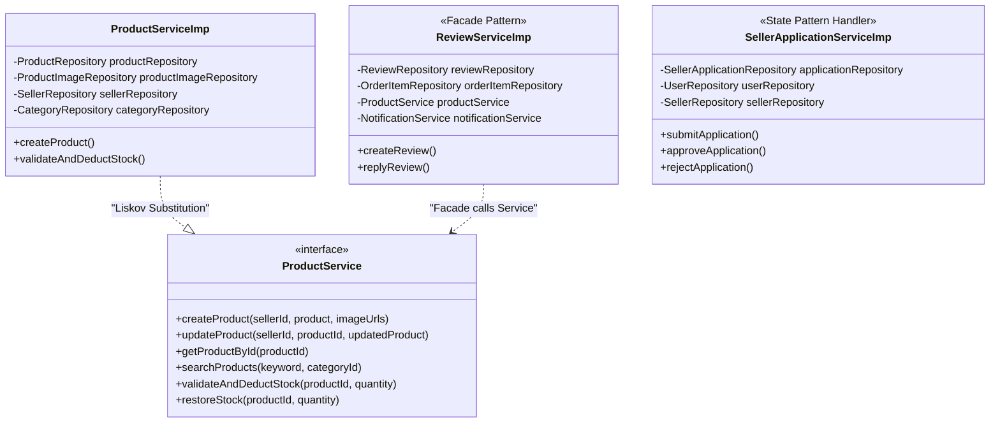

# เอกสารการวิเคราะห์ Design Patterns (Design Patterns Analysis)
### วิชา: CP353002 Principles of Software Design and Development
**ระบบ:** PandaStore E-Commerce Marketplace  
**ผู้พัฒนา:** นายณัฐพงษ์ คนธนกิจ (Nattapong Gontanagit) รหัสนักศึกษา: 673380038-9 Section: 2  
**โมดูลที่รับผิดชอบ:** Product Management (UC4), Review & Rating System (UC5), Seller Application Workflow (UC3)

---

## 1. Enterprise / Architectural Patterns

| Pattern | ปัญหาที่แก้ไข | การนำไปใช้จริงในโค้ด | เหตุผลและความคุ้มค่า |
|---|---|---|---|
| **Layered Architecture** | การเขียนโค้ดปะปนกันระหว่าง Business Logic และการคิวรีฐานข้อมูล | แบ่งแยก Service Layer $\rightarrow$ Persistence (Repository) $\rightarrow$ Database อย่างชัดเจน | โค้ดอ่านง่าย สามารถแยกทดสอบเฉพาะส่วนได้ (Loose Coupling) และบำรุงรักษาง่าย |
| **Repository Pattern** | การจัดการ Query SQL ตรงๆ ใน Business Logic ก่อให้เกิด Duplication และผูกติดเทคโนโลยี DB | Spring Data JPA Interfaces เช่น [`ProductRepository`](file:///C:/Users/Petchy_STB/Desktop/Lab_673380038-9/Project/PandaStore/backend/src/main/java/project/project/Repository/ProductRepository.java), [`ReviewRepository`](file:///C:/Users/Petchy_STB/Desktop/Lab_673380038-9/Project/PandaStore/backend/src/main/java/project/project/Repository/ReviewRepository.java), [`SellerApplicationRepository`](file:///C:/Users/Petchy_STB/Desktop/Lab_673380038-9/Project/PandaStore/backend/src/main/java/project/project/Repository/SellerApplicationRepository.java) | คัดแยก Data Access Layer ออกเป็น Collection-like Interface สามารถสลับ DB หรือ Mock ได้ง่ายใน Unit Test |
| **Service Layer Pattern** | Business Logic กระจัดกระจายและไม่สามารถควบคุม Transaction ได้ | [`ProductServiceImp`](file:///C:/Users/Petchy_STB/Desktop/Lab_673380038-9/Project/PandaStore/backend/src/main/java/project/project/Service/implement/ProductServiceImp.java), [`ReviewServiceImp`](file:///C:/Users/Petchy_STB/Desktop/Lab_673380038-9/Project/PandaStore/backend/src/main/java/project/project/Service/implement/ReviewServiceImp.java), [`SellerApplicationServiceImp`](file:///C:/Users/Petchy_STB/Desktop/Lab_673380038-9/Project/PandaStore/backend/src/main/java/project/project/Service/implement/SellerApplicationServiceImp.java) | รวม Workflow สำคัญ เช่น การตัดสต็อก, การตรวจสอบ Verified Purchase, และการแปลงสถานะเปิดร้านค้าไว้ที่จุดเดียว พร้อมควบคุม `@Transactional` |
| **Dependency Injection (DI)** | คลาสผู้เรียกผูกติดกับ Concrete Class (Tight Coupling) ทำให้ Unit Test ได้ยากมาก | ใช้ 100% Constructor Injection ใน Service ทุกตัว โดยพึ่งพาผ่าน Repository และ Service Interface เท่านั้น | สอดคล้องกับ DIP (Dependency Inversion Principle) ง่ายต่อการฉีด Mock เข้ามาทดสอบผ่าน `@ExtendWith(MockitoExtension.class)` |

---

## 2. GoF Design Patterns

### 2.1 Creational Patterns
1. **Singleton Pattern**:
   - **ตำแหน่ง:** Spring Managed Components ทั้งหมด (`@Service`, `@Repository`) เช่น `ProductServiceImp`, `ReviewServiceImp`, `SellerApplicationServiceImp`
   - **เหตุผล:** ประหยัด Memory และ Resource โดยสร้าง Instance เดียวต่อ Spring Application Context (Thread-safe Stateless Services)

### 2.2 Structural Patterns
1. **Facade Pattern**:
   - **ตำแหน่ง:** `ReviewServiceImp` ทำหน้าที่ประสานงานร่วมกันระหว่าง Subsystems ย่อย ได้แก่ `OrderItemRepository`, `CustomerRepository`, `ReviewRepository`, `ProductService`, และ `NotificationService`
   - **เหตุผล:** ผู้เรียกใช้งานเรียกเมธอดเดียว เช่น `createReview()` โดยไม่ต้องรู้ว่าระบบเบื้องหลังต้องตรวจสอบ Order, คำนวณคะแนนเฉลี่ยสินค้าใหม่ และส่ง Notification ไปยัง Seller อย่างไร
2. **Proxy Pattern**:
   - **ตำแหน่ง:** Spring Dynamic Proxies สำหรับ `@Transactional` ใน `ProductServiceImp`, `ReviewServiceImp`, `SellerApplicationServiceImp`
   - **เหตุผล:** ควบคุมการทำ Commit/Rollback Transaction ของ Database เมื่อเกิด Exception อัตโนมัติโดยไม่ต้องแทรกโค้ด Boilerplate จัดการ Connection

### 2.3 Behavioral Patterns
1. **State Pattern / Finite State Lifecycle**:
   - **ตำแหน่ง:** การเปลี่ยนผ่านสถานะใน [`SellerApplicationStatus`](file:///C:/Users/Petchy_STB/Desktop/Lab_673380038-9/Project/PandaStore/backend/src/main/java/project/project/Entity/seller/SellerApplicationStatus.java) (`PENDING` $\rightarrow$ `APPROVED` / `REJECTED` / `NEED_MORE_DOC`) และ [`ProductStatus`](file:///C:/Users/Petchy_STB/Desktop/Lab_673380038-9/Project/PandaStore/backend/src/main/java/project/project/Entity/product/ProductStatus.java) (`ACTIVE` $\leftrightarrow$ `OUT_OF_STOCK`)
   - **เหตุผล:** ควบคุมเงื่อนไขและการเปลี่ยนแปลงพฤติกรรมของ Entity ตาม State ที่ถูกต้องตาม Business Rule เช่น ไม่อนุญาตให้ตัดสต็อกสินค้าที่ OUT_OF_STOCK
2. **Observer / Pub-Sub Notification**:
   - **ตำแหน่ง:** การแจ้งเตือนเหตุการณ์ผ่าน `NotificationService` เมื่อเกิด Review ใหม่ (`NEW_REVIEW`) หรือเมื่อร้านค้าได้รับการอนุมัติ (`SELLER_APPROVED`)
   - **เหตุผล:** Service หลักไม่ต้องผูกติดกับเทคโนโลยีการแจ้งเตือน หากต้องการเปลี่ยนช่องทางส่งแจ้งเตือนเป็น Web Push, Email หรือ Line Notify สามารถทำได้ที่จุดเดียว

---

## 3. ตารางสรุปการประยุกต์ใช้ Pattern ใน Service Layer

| หมวดหมู่ | Design Pattern | ปัญหาที่แก้ไข | คลาส / ไฟล์ที่นำไปใช้จริง |
|---|---|---|---|
| **Enterprise** | Layered Architecture | ละเมิด Separation of Concerns | Service $\rightarrow$ Repository $\rightarrow$ Database |
| **Enterprise** | Repository Pattern | Logic ฐานข้อมูลปนเปื้อนใน Service | `ProductRepository`, `ReviewRepository`, `SellerApplicationRepository` |
| **Enterprise** | Dependency Injection | ผูกติดกับ Concrete Class (Tight Coupling) | Constructor Injection ในทุก Service Implementation |
| **Creational** | Singleton Pattern | Overhead ในการสร้าง Object ซ้ำๆ ใน Request | Spring Beans (`@Service`, `@Repository`) |
| **Structural** | Facade Pattern | ความซับซ้อนของขั้นตอนรีวิวและสมัครร้าน | `ReviewServiceImp`, `SellerApplicationServiceImp` |
| **Structural** | Proxy Pattern | จัดการ Database Transaction Boilerplate | `@Transactional` ในทุก Service Implementation |
| **Behavioral** | State Pattern | การเปลี่ยนสถานะใบสมัคร/สต็อกสินค้าไร้ระเบียบ | `SellerApplicationStatus`, `ProductStatus` |
| **Behavioral** | Observer Pattern | การแจ้งเตือนผูกติดกับ Business Logic | `NotificationService` Integration |

---

## 4. Class Diagram

