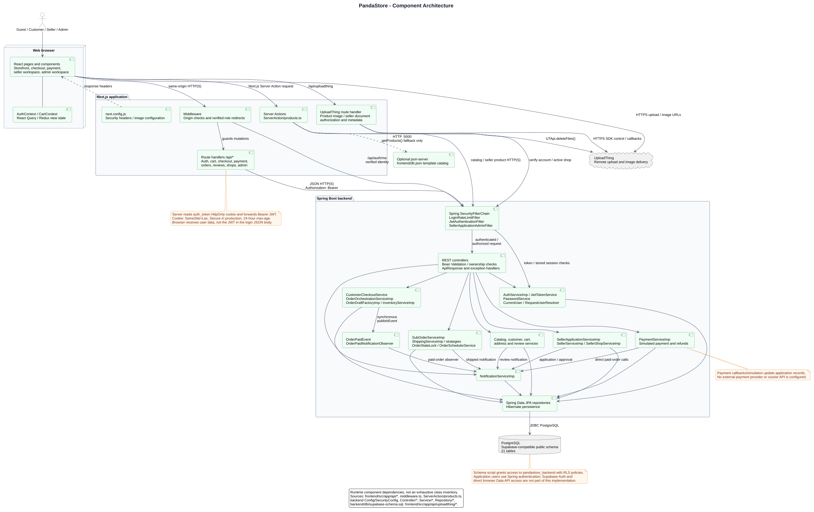
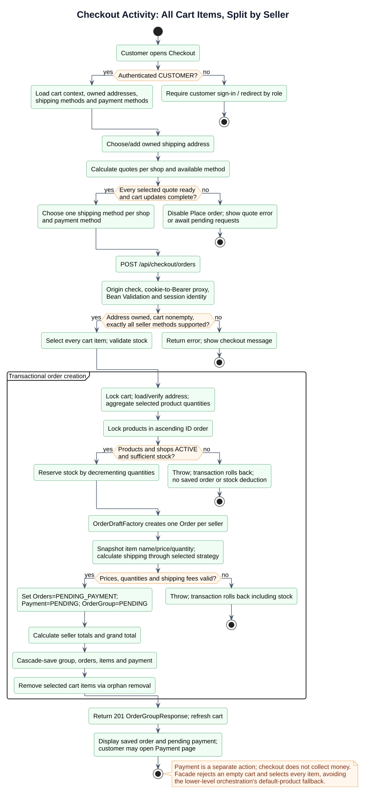

# PandaStore diagrams

These English PlantUML documents describe the current repository implementation. Each of the **19 standalone diagrams** has an editable `.puml` source and a generated `.svg` image. `_style.puml` is a shared include, not a standalone diagram.

The intended readers are project reviewers and developers. Domain concepts, implementation classes and physical database tables are presented separately. Source references are included in diagram comments, notes or legends and in the use case descriptions.

## Required documentation

| Requirement | Editable sources | Rendered diagrams / accompanying text |
| --- | --- | --- |
| Use Case Diagram + Use Case Description | [Use cases](use-cases.puml) | [SVG](use-cases.svg), [27 use case descriptions and public route inventory](use-case-descriptions.md) |
| Domain Model / Conceptual Class Diagram | [Domain model](domain-model.puml) | [SVG](domain-model.svg) |
| Class Diagram with Design Pattern locations | [Core classes](class-core.puml), [Design patterns](class-patterns.puml) | [Core SVG](class-core.svg), [Patterns SVG](class-patterns.svg) |
| Sequence Diagrams: at least three principal scenarios | [Login](sequence-login.puml), [Checkout](sequence-checkout.puml), [Payment simulation](sequence-payment.puml), [Seller approval](sequence-seller-approval.puml), [Fulfillment](sequence-fulfillment.puml) | [Login SVG](sequence-login.svg), [Checkout SVG](sequence-checkout.svg), [Payment SVG](sequence-payment.svg), [Approval SVG](sequence-seller-approval.svg), [Fulfillment SVG](sequence-fulfillment.svg) |
| Activity Diagram | [Checkout](activity-checkout.puml), [Seller application review](activity-seller-application.puml) | [Checkout SVG](activity-checkout.svg), [Seller application SVG](activity-seller-application.svg) |
| ER Diagram / Database Schema | [ER schema](er-schema.puml) | [SVG](er-schema.svg), [Existing SQL schema](../../backend/db/supabase-schema.sql) |
| Component Diagram & Deployment Diagram | [Components](component.puml), [Deployment](deployment.puml) | [Component SVG](component.svg), [Deployment SVG](deployment.svg) |
| State Diagrams for entities with lifecycle state | [Order](state-order.puml), [Payment / OrderGroup](state-payment.puml), [SellerApplication](state-seller-application.puml), [Shipment](state-shipment.puml), [Product](state-product.puml) | [Order SVG](state-order.svg), [Payment SVG](state-payment.svg), [Application SVG](state-seller-application.svg), [Shipment SVG](state-shipment.svg), [Product SVG](state-product.svg) |

## Architecture preview



## Checkout preview



## Reading the models

- **Use cases:** Guest, Customer, Seller and Admin capabilities are mapped to implemented interfaces. Backend-only operations are labeled. Wishlist, coupons, contact forms and other template content without a corresponding implemented business flow are excluded.
- **Domain model:** business concepts and multiplicities, without SQL types or repository classes. Customer and Seller profiles reference User; they are not subclasses of User.
- **Core classes:** all 20 JPA entity classes with selected fields and their actual associations. Routine accessors and lifecycle timestamps are omitted. The companion pattern diagram shows the relevant service contracts, implementations, event classes and repositories.
- **Design patterns:** shipping Strategy, strategy selection factory, aggregate construction through `OrderDraftFactory`, Spring Data Repository and synchronous Spring event Observer. The factory components are shown according to their actual implementations; the diagrams do not claim a GoF Factory Method subclass hierarchy.
- **ER schema:** all 21 tables, 158 columns and 28 foreign keys from the existing SQL script, including `product_categories`. PK, FK, unique constraints and nullability are shown. Enum columns use the SQL varchar types; their CHECK definitions are in the linked schema source. The script matches the 20 JPA entity tables plus the join table; this is repository schema documentation, not a live database inspection.
- **Deployment:** the topology follows configuration defaults and supported external services. Development ports are 3000 and 8080; PostgreSQL host, port and TLS come from `DB_URL`. Production hostnames and actual infrastructure have not been verified.
- **State diagrams:** arrows represent implemented service behavior. Enum membership alone does not imply a guarded lifecycle transition. User/Seller status enums appear in the class model; the five state diagrams focus on the implemented business lifecycles.

## Current implementation limitations

These observations explain differences between the diagrams and an idealized marketplace workflow. They are existing application behavior, not changes made by this documentation.

1. **Payment is simulated.** The frontend payment proxy calls `PaymentServiceImp`, which sends notifications directly. `OrderOrchestrationServiceImp.handlePaymentSuccess` publishes `OrderPaidEvent` to a synchronous observer inside the transaction, but that is a separate service path, not the simulation callback. No external payment provider or courier API is configured.
2. **Failure and refund paths differ.** `PaymentServiceImp` payment failure updates payment/group states without releasing inventory or cancelling orders. Orchestration failure releases inventory and cancels orders. Direct administrative refunds do not restore stock; rejection/cancellation services restore it separately. An unpaid sub-order cancellation can leave the Payment record PENDING.
3. **Order and Shipment state are independent.** Customer receipt completes the Order without setting Shipment to DELIVERED. Administrative shipment updates accept any `ShippingStatus` value without a transition guard.
4. **Seller application review is permissive.** Rejection and requests for documents do not restrict the current application status. Approval prevents an already approved application or an existing seller. There is no endpoint to edit/resubmit the same application; a new application can be submitted after rejection or a document request. The legacy seller registration endpoint creates a pending seller immediately and conflicts with normal approval.
5. **Stock does not always drive ProductStatus.** Checkout `InventoryServiceImp.reserve/release` adjusts stock only. ProductService stock operations and product updates can change ProductStatus; public catalog queries separately require positive stock and active seller/user status.
6. **Scheduled cancellation has a query limitation.** The unconfirmed-order scheduler queries `shippedAt` for WAITING_SELLER_CONFIRM orders, whose shipped timestamp is normally null. The diagrams do not promise a working 24-hour cancellation. Shipped orders have the implemented seven-day auto-confirm path. The automatic review helper has no current controller/scheduler caller.
7. **Shipping configuration is not the strategy input.** The `shipping.fees.*` properties are currently unused by the strategy implementations. For example, STANDARD uses 30.00 and THAILANDPOST uses 35.00 rather than the apparent STANDARD property value.
8. **Some backend interfaces are broader than the UI.** Direct stock APIs have authentication-only access. Product update is API-only and its controller does not enforce a universal SELLER-only policy; the service validates the supplied seller/product relationship. The public route inventory distinguishes permitted patterns from actual controller routes. The frontend cancellation proxy does not verify every individual cancellation response.

See the source-linked [use case descriptions](use-case-descriptions.md) and the relevant diagrams for guards and alternate paths. No application code, schema, dependency version or security rule was changed to produce these documents.

## Render locally

Requirements: Java 21 and PlantUML **1.2026.8**. Use Git Bash on Windows or a Linux/WSL shell with Java. PlantUML bundles the minimal Graphviz executable for Windows; Linux/WSL requires Graphviz for the graph-based diagrams. See [PlantUML Graphviz setup](https://plantuml.com/graphviz-dot) and [command-line documentation](https://plantuml.com/command-line).

From the repository root, download the pinned renderer and verify its published checksum:

```bash
tool_dir="$PWD/backend/target/diagram-tools"
mkdir -p "$tool_dir"
jar_name="plantuml-1.2026.8.jar"
base_url="https://repo.maven.apache.org/maven2/net/sourceforge/plantuml/plantuml/1.2026.8"
curl --fail --location "$base_url/$jar_name" --output "$tool_dir/$jar_name"
curl --fail --location "$base_url/$jar_name.sha256" --output "$tool_dir/$jar_name.sha256"
printf '%s  %s\n' "$(cat "$tool_dir/$jar_name.sha256")" "$tool_dir/$jar_name" | sha256sum --check --strict
export PLANTUML_JAR="$tool_dir/$jar_name"
bash doc/diagrams/render.sh check
bash doc/diagrams/render.sh
```

The script checks all standalone sources before generating SVGs beside their sources. It excludes only the shared `_style.puml` include. `JAVA_BIN` can select a Java executable; `PLANTUML_LIMIT_SIZE` defaults to 16384 for the large ER diagram. Rendering is local; no diagram sources are submitted to an online rendering service. Tool binaries and intermediate previews live in the existing ignored build-output directory and are not documentation assets.

## Verification

Diagram verification requires successful syntax checks, generation of all 19 SVGs, inspection of readable layouts, matching use case IDs/source links, and schema parity. Runtime verification is the unchanged repository gate:

```bash
bash scripts/security-check.sh
```

The gate requires running frontend/backend servers, dependency scanners, Gitleaks and Semgrep. A diagram render pass does not establish a security gate pass. See [verification results](verification.md) for the checks and any remaining blockers from this documentation run.
